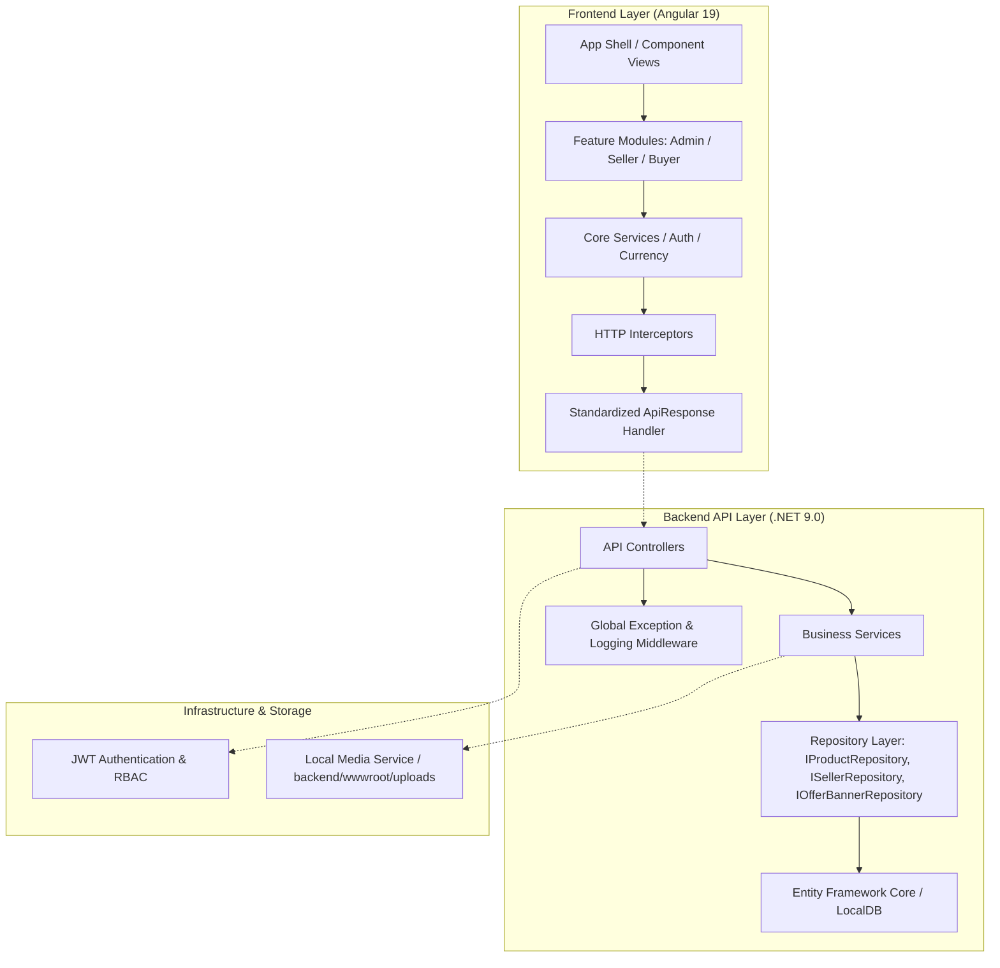

# 🛍️ MerxoSell — Advanced Full-Stack E-Commerce Platform

[](#-testing)
[](frontend)
[](backend)
[](database)

Welcome to **MerxoSell**, a modern, high-performance e-commerce marketplace platform built with **ASP.NET Core 9.0 Web API** and **Angular 19**.

---

## 🏗️ Architecture Overview

The application is engineered using **Clean N-Tier Architecture** and the **Repository Pattern**, decoupling business logic from data access and ensuring seamless scalability.



### Key Highlights & Recent Enhancements
- **Razorpay Payment Gateway Integration**: Unified payment gateway supporting Cards, UPI, NetBanking, and Wallets via Razorpay Checkout JS modal. Configured with user email `suthary980@gmail.com`.
- **Payment Reference Tracking & Admin Cross-Verification**: Automatically captures and records Razorpay Payment Transaction IDs (e.g. `pay_TPA3SXiKMUDRYH`) upon order completion and displays them in the Admin Orders dashboard for verification.
- **Dynamic Offer Banner Engine**: Support for `Hero`, `MidLeft`, `MidRight`, and `Strip` slots with auto-scrolling carousels, customizable indicator controls, hover-pause, and direct product-link redirection.
- **Local Asset Management & Robust Image Fallbacks**: Automated backend image upload processing (`/uploads/`) with frontend `(error)` image fallback protection to eliminate broken links.
- **Role-Based Access Control (RBAC)**: Fine-grained security policies for `SuperAdmin`, `Seller`, and `Buyer` roles powered by BCrypt and JWT.
- **Comprehensive E-Commerce Capabilities**: Product catalog management, multi-variant options, cart drawer, checkout flow, coupon discounts, order tracking, review moderation, and seller analytics dashboards.

---

## 🛠️ Technology Stack

| Module | Technologies Used |
| :--- | :--- |
| **Frontend** | Angular 19, TypeScript, RxJS, SCSS Theme Architecture, Chart.js |
| **Backend** | .NET 9.0 Web API, C#, Entity Framework Core 9 |
| **Database** | Microsoft SQL Server (LocalDB / MSSQLLocalDB) |
| **Authentication** | JWT (JSON Web Tokens), BCrypt Password Hashing |
| **Storage & Media** | ASP.NET Core Static Files (`wwwroot/uploads`) |
| **Testing** | xUnit, Moq, FluentAssertions (Backend) / Vitest & Jasmine (Frontend) |

---

## 📁 Repository Directory Structure

```text
MerxoSell/
├── backend/                  # .NET 9.0 Web API Project
│   ├── Controllers/          # REST Endpoints (Products, Banners, Seller, Orders, Media)
│   ├── Services/             # Core Business Logic & Media Handling
│   ├── Repositories/         # Repository Pattern Data Access Layer
│   ├── Data/                 # AppDbContext & EF Core Entity Configurations
│   ├── Models/               # Domain Entity Models
│   ├── DTOs/                 # Request & Response Contracts
│   ├── wwwroot/uploads/      # Local Storage for Uploaded Media Assets
│   └── MerxoSell.Tests/      # Unit and Integration Tests
├── frontend/                 # Angular 19 Single Page Application (SPA)
│   ├── src/app/features/     # Modular Views (Home, Products, Seller, Admin, Cart, Auth)
│   ├── src/app/core/         # Services, Guards, Interceptors, and Models
│   └── src/app/shared/       # Reusable UI Components (OfferBanners, ProductCard, Header)
├── database/                 # SQL Database Scripts & Schema Definitions
│   ├── schema/               # DDL Tables & Indexes
│   └── seed/                 # Seed Data SQL Scripts
└── automation/               # Automated Python API & UI Test Suite
```

---

## 🚀 Getting Started

### Prerequisites
- [.NET 9.0 SDK](https://dotnet.microsoft.com/download/dotnet/9.0)
- [Node.js (v20+)](https://nodejs.org/) & `npm`
- Microsoft SQL Server LocalDB (`(localdb)\MSSQLLocalDB`)

---

### 1. Backend Setup & Startup

```bash
# Navigate to backend folder
cd backend

# Restore dependencies
dotnet restore

# Run EF Core database migrations (creates MerxoSellDb)
dotnet ef database update

# Launch the API server (Runs on http://localhost:5000)
dotnet run
```

#### 💳 Razorpay Configuration Setup
To enable live/test payment processing via Razorpay, update the `"Razorpay"` section in `backend/appsettings.json`:

```json
"Razorpay": {
  "KeyId": "YOUR_RAZORPAY_KEY_ID",
  "KeySecret": "YOUR_RAZORPAY_KEY_SECRET",
  "AccountEmail": "suthary980@gmail.com",
  "AccountPassword": "YOUR_RAZORPAY_ACCOUNT_PASSWORD"
}
```
*Note: Replace `YOUR_RAZORPAY_KEY_ID` and `YOUR_RAZORPAY_KEY_SECRET` with your API keys from the [Razorpay Dashboard](https://dashboard.razorpay.com/).*

---

### 2. Frontend Setup & Startup

```bash
# Navigate to frontend folder
cd frontend

# Install node dependencies
npm install

# Start the Angular development server
npm run dev
# Or
npx ng serve --open
```

Open your browser at `http://localhost:4200` to access the application.

---

## 🧪 Testing

### Backend Unit & Integration Tests
```bash
# From repo root — run all test projects
dotnet test MerxoSell.sln

# Filter for unit tests
dotnet test backend/MerxoSell.Tests/MerxoSell.Tests.csproj --filter "FullyQualifiedName!~Integration"
```

### Frontend Tests
```bash
cd frontend
npm test
```

---

## 🔒 Default Accounts

| Role | Email | Password |
| :--- | :--- | :--- |
| **Super Admin** | `admin@MerxoSell.com` | `Admin@123` |
| **Seller** | `seller@MerxoSell.com` | `Seller@123` |
