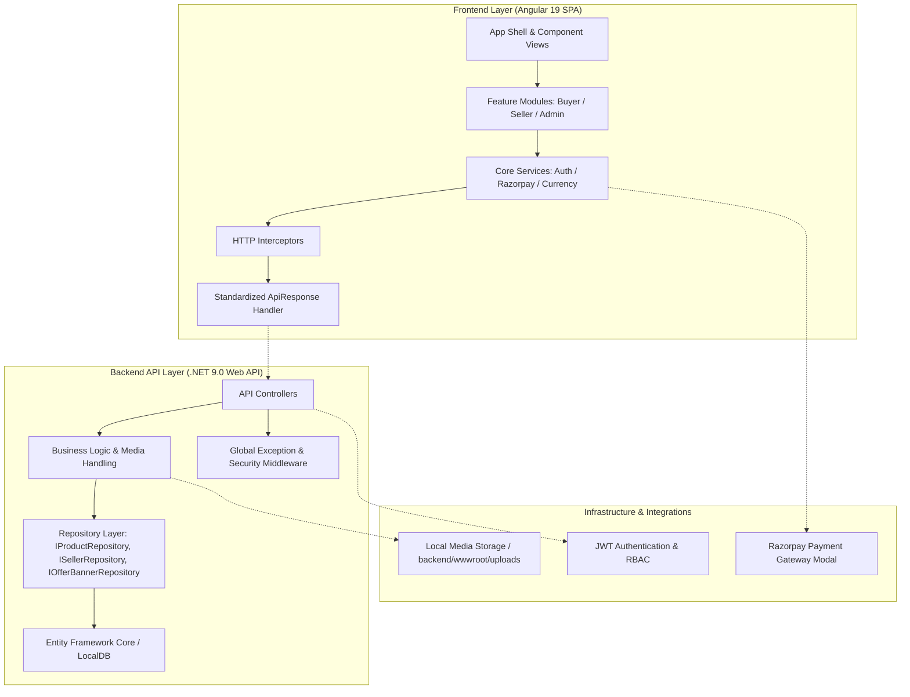

# 🛍️ MerxoSell — Multi-Vendor E-Commerce Platform

**Zero Commission. All Verified. Global Reach.**

A modern, high-performance, full-stack e-commerce marketplace platform built with **ASP.NET Core 9.0 Web API** and **Angular 19**. MerxoSell empowers buyers, sellers, and administrators with direct seller contact, instant payment processing via Razorpay, dynamic promotional banners, real-time inventory tracking, and role-based management.

[](frontend)
[](backend)
[](database)
[](https://razorpay.com)
[](LICENSE)

---

## ⚡ The Problem & The Solution

### ❌ The Problem
Traditional e-commerce platforms charge exorbitant seller commission fees, impose complex payout delays, suffer from unverified product listings, lack transparent transaction tracking, and deliver fragmented mobile and web experiences.

### ✅ The Solution
**MerxoSell** solves these challenges by providing:
- **Zero-Commission Marketplace**: Enables independent sellers to retain 100% of their earnings with direct seller onboarding and management.
- **Automated Payment Tracking**: Direct Razorpay payment integration with automated reference capture and admin verification.
- **Dynamic Merchandising Engine**: High-converting offer banners, carousel controls, product categorizations, and flash deal engines.
- **Cross-Device Optimization**: Designed ground-up for pixel-perfect web and mobile experiences.

---

## 🏗️ Architecture Overview

MerxoSell is engineered using **Clean N-Tier Architecture** and the **Repository Pattern**, decoupling business logic from data access and ensuring seamless scalability.



---

## ✨ Key Highlights & Features

- **💳 Razorpay Payment Gateway**: Built-in support for Cards, UPI, NetBanking, and Wallets via Razorpay Checkout JS modal, configured for account `suthary980@gmail.com`.
- **🔍 Payment Reference Tracking**: Automatically records Razorpay Payment Transaction IDs (`pay_XXXXXX`) upon order placement for administrative cross-verification.
- **🎠 Dynamic Offer Banner Engine**: Supports `Hero`, `MidLeft`, `MidRight`, and `Strip` banner placements with auto-scrolling carousels, hover pause, and product routing.
- **🛡️ Role-Based Access Control (RBAC)**: Enforces granular security policies across `SuperAdmin`, `Seller`, and `Buyer` accounts using JWT and BCrypt hashing.
- **📦 Multi-Vendor Operations**: Seller management dashboard, product inventory tracking, order status workflows, and sales analytics.
- **🖼️ Asset Management & Fallbacks**: Automated backend image upload processing (`/uploads/`) with graceful frontend fallback protection.

---

## 🛠️ Technology Stack

| Layer | Technologies & Tools |
| :--- | :--- |
| **Frontend Framework** | Angular 19, TypeScript, RxJS, SCSS Design System |
| **Backend Framework** | ASP.NET Core 9.0 Web API, C#, Entity Framework Core 9 |
| **Database** | Microsoft SQL Server (LocalDB / `MSSQLLocalDB`) |
| **Authentication** | JWT (JSON Web Tokens), BCrypt Hashing |
| **Payment Gateway** | Razorpay JS SDK & Verification API |
| **Testing** | xUnit, Moq, FluentAssertions (Backend) / Jasmine & Vitest (Frontend) |
| **Automation** | Python Automated API & UI Test Suites (`pytest`, `playwright`) |

---

## 📁 Repository Directory Structure

```text
MerxoSell/
├── docs/                     # Project documentation & visual assets
│   └── assets/               # Banner images & UI mockups (merxosell_hero_banner.jpg)
├── backend/                  # .NET 9.0 Web API Project
│   ├── Controllers/          # REST Endpoints (Products, Banners, Seller, Orders, Media)
│   ├── Services/             # Business Logic & Upload Services
│   ├── Repositories/         # Data Access Layer Implementation
│   ├── Data/                 # AppDbContext & EF Core Entity Configurations
│   ├── Models/               # Domain Entities
│   ├── DTOs/                 # Request & Response Contracts
│   ├── wwwroot/uploads/      # Uploaded Product Media Assets
│   └── MerxoSell.Tests/      # Backend Unit & Integration Tests
├── frontend/                 # Angular 19 Single Page Application
│   ├── src/app/features/     # Modular Views (Home, Products, Seller, Admin, Cart, Auth)
│   ├── src/app/core/         # Core Services, Auth, Payment & Interceptors
│   └── src/app/shared/       # Reusable UI Components & Banner Carousels
├── database/                 # Database Schema & Seed Data
│   ├── schema/               # DDL SQL Table Definitions
│   └── seed/                 # Seed Data SQL Scripts (`001_complete_seed.sql`)
├── automation/               # Python Automated API & UI Test Suites
├── CONTRIBUTING.md           # Contribution Guidelines & Code of Conduct
├── LICENSE                   # MIT Open Source License
├── SECURITY.md               # Vulnerability Reporting & Security Policies
└── README.md                 # Project Overview & Setup Instructions
```

---

## 🚀 Getting Started

### Prerequisites
- [.NET 9.0 SDK](https://dotnet.microsoft.com/download/dotnet/9.0)
- [Node.js (v20+)](https://nodejs.org/) & `npm`
- Microsoft SQL Server LocalDB (`(localdb)\MSSQLLocalDB`)

---

### 1. Backend Setup

```bash
# Navigate to backend directory
cd backend

# Restore dependencies
dotnet restore

# Apply EF Core migrations to build database schema
dotnet ef database update

# Start backend server (runs on http://localhost:5000)
dotnet run
```

#### 💳 Razorpay Configuration
To configure live or test API keys, update `backend/appsettings.json`:
```json
"Razorpay": {
  "KeyId": "YOUR_RAZORPAY_KEY_ID",
  "KeySecret": "YOUR_RAZORPAY_KEY_SECRET",
  "AccountEmail": "suthary980@gmail.com"
}
```

---

### 2. Frontend Setup

```bash
# Navigate to frontend directory
cd frontend

# Install Node modules
npm install

# Launch Angular development server
npm run dev
# Or
npx ng serve --open
```

Open browser at **`http://localhost:4200`** to access MerxoSell.

---

## 🧪 Running Tests

### Backend Tests
```bash
# Run all unit and integration tests
dotnet test MerxoSell.sln
```

### Frontend Tests
```bash
cd frontend
npm test
```

### Automated E2E & API Tests
```bash
cd automation
python run_all.py
```

---

## 🔒 Default Login Credentials

| Role | Email | Password |
| :--- | :--- | :--- |
| **Super Admin** | `admin@MerxoSell.com` | `Admin@123` |
| **Seller** | `seller@MerxoSell.com` | `Seller@123` |

---

## 👥 Contributors

Thanks to the following people who maintain and contribute to **MerxoSell**:

<a href="https://github.com/prakashinfotech/merxo-sell/graphs/contributors">
  
</a>

- **[Yogesh Suthar](https://github.com/psspl-yogesh)** — Lead Full-Stack Developer & Maintainer
- **[Prakash Infotech](https://github.com/prakashinfotech)** — Project Sponsor & Core Engineering Team

---

## 📄 License

This project is licensed under the **MIT License** — see the [LICENSE](LICENSE) file for details.

---

## 🛡️ Security

For reporting security vulnerabilities, please refer to our [SECURITY.md](SECURITY.md).

---

## 🤝 Contributing

Contributions, issues, and feature requests are welcome! Feel free to check [CONTRIBUTING.md](CONTRIBUTING.md).
