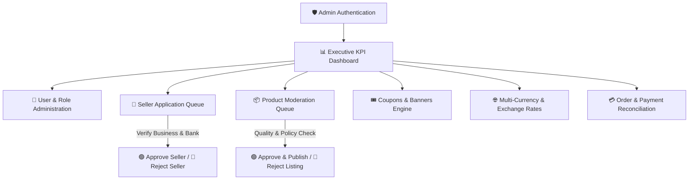

# 🛡️ Merxo Admin Control Panel — Governance & Management Manual

> **Welcome to the Merxo Platform Administration Manual!**  
> This document provides super-user instructions for managing system security, user permissions, seller application approvals, catalog moderation, coupon campaigns, multi-currency settings, and financial oversight.

---

## 🎯 Quick Navigation & Role Overview

| Attribute | Details |
| :--- | :--- |
| **User Role** | System Administrator / Platform Moderator |
| **Admin Portal URL** | `https://merxo.com/admin` (or local `http://localhost:4200/admin`) |
| **Security Guard** | `AdminGuard` (JWT Bearer Token with `Admin` claim) |
| **Scope of Authority** | Global User Control, Product Takedowns, Seller Approvals, Financial Reconciliation |

---

## 🗺️ Administrative Governance Workflow



---

## 📌 Table of Contents

1. [Admin Authentication & Access Control](#1-admin-authentication--access-control)
2. [Executive Admin Dashboard](#2-executive-admin-dashboard)
3. [User & Customer Directory Management](#3-user--customer-directory-management)
4. [Seller Onboarding & Moderation Queue](#4-seller-onboarding--moderation-queue)
5. [Product Catalog Moderation](#5-product-catalog-moderation)
6. [Category Hierarchy & Banner Campaigns](#6-category-hierarchy--banner-campaigns)
7. [Coupons & Promotional Discount Engine](#7-coupons--promotional-discount-engine)
8. [Multi-Currency & Live Exchange Rates](#8-multi-currency--live-exchange-rates)
9. [Platform Order Oversight & Razorpay Reconciliation](#9-platform-order-oversight--razorpay-reconciliation)
10. [Content & Review Moderation](#10-content--review-moderation)

---

## 1. Admin Authentication & Access Control

```
┌─────────────────────────────────────────────────────────────────────────────────────────────────┐
│ 🛡️ MERXO ADMINISTRATIVE CONTROL PANEL                                                          │
├─────────────────────────────────────────────────────────────────────────────────────────────────┤
│ Admin Email:     [ admin@merxo.com                            ]                                 │
│ Admin Password:  [ •••••••••••••••••••••                      ]                                 │
│ Security Token:  [ 2FA Authenticator Code                     ]                                 │
│                                                                                                 │
│                                                   [ 🔒 SECURE ADMIN LOGIN ]                     │
└─────────────────────────────────────────────────────────────────────────────────────────────────┘
```

> [!CAUTION]
> The Admin Portal URL (`/admin`) is restricted exclusively to authenticated users with **Admin permissions**. Unauthorized attempts are logged and blocked automatically by `AdminGuard`.

---

## 2. Executive Admin Dashboard

### 📊 System Executive Dashboard Wireframe

```
┌─────────────────────────────────────────────────────────────────────────────────────────────────┐
│ 📊 EXECUTIVE PLATFORM CONTROL CENTER                                      [ 🟢 System Status: OK ]│
├──────────────────────────┬──────────────────────────┬──────────────────────────┬────────────────┤
│ 💎 GROSS GMV             │ 👥 TOTAL USERS           │ 🏬 ACTIVE SELLERS        │ 📦 LIVE ITEMS   │
│ $ 1,482,900.00           │ 14,250 Customers         │ 312 Approved Stores      │ 24,800 Items   │
│ 📈 +18.5% YoY            │ 📈 +340 this week        │ 🟡 5 Pending Applications│ 🟡 14 Moderation│
└──────────────────────────┴──────────────────────────┴──────────────────────────┴────────────────┘

┌─────────────────────────────────────────────────────────────────────────────────────────────────┐
│ 📉 REAL-TIME PLATFORM METRICS & TRANSACTION VOLUME                                              │
│  Orders/Min ┤       ╭─╮           ╭──╮                                                          │
│        40   ┤      ╱   ╰╮        ╱    ╰╮   ╭──╮                                                 │
│        20   ┤  ╭──╯     ╰───────╯      ╰──╯    ╰───                                             │
│         0   └─┴─────────┴─────────┴─────────┴──────┴─────────────────────────────────────────  │
│              08:00     10:00     12:00     14:00   16:00                                        │
└─────────────────────────────────────────────────────────────────────────────────────────────────┘
```

---

## 3. User & Customer Directory Management

```
┌─────────────────────────────────────────────────────────────────────────────────────────────────┐
│ 👥 USER MANAGEMENT DIRECTORY                                      [ 🔍 Search email/name...   ] │
├──────┬────────────────────────┬─────────────────────┬──────────────┬──────────────┬─────────────┤
│ ID   │ Name                   │ Email               │ Role         │ Status       │ Action      │
├──────┼────────────────────────┼─────────────────────┼──────────────┼──────────────┼─────────────┤
│ #101 │ Sarah Jenkins          │ sarah@gmail.com     │ 🛒 Buyer     │ 🟢 Active    │ [ ⚙️ Edit ] │
│ #102 │ Apex Electronics       │ seller@apex.com     │ 🏬 Seller    │ 🟢 Active    │ [ ⚙️ Edit ] │
│ #103 │ Robert Vance           │ rvance@outlook.com  │ 🛒 Buyer     │ 🔴 Suspended │ [ 🔓 Enable]│
└──────┴────────────────────────┴─────────────────────┴──────────────┴──────────────┴─────────────┘
```

### Key Administrative User Actions
- **Filter Users by Role**: View Buyers, Sellers, or Admins.
- **Account Suspension**: Disable accounts violating marketplace safety policies.
- **Promote / Change Role**: Grant administrative or moderation rights to trusted staff accounts.

---

## 4. Seller Onboarding & Moderation Queue

### 🏬 Seller Application Review Modal

```
┌─────────────────────────────────────────────────────────────────────────────────────────────────┐
│ 🏬 SELLER APPLICATION REVIEW: Apex Electronics Ltd                                               │
├─────────────────────────────────────────────────────────────────────────────────────────────────┤
│ Owner Name:       John Doe                   Contact Phone:     +1 (555) 234-5678               │
│ Business Tax ID:  TAX-98421098               Bank Account:      **** **** 8842 (Verified)     │
│ Address:          100 Market St, Suite 400, San Francisco, CA 94105                            │
├─────────────────────────────────────────────────────────────────────────────────────────────────┤
│                                                                                                 │
│  [ 🔴 REJECT WITH REASON ]                            [ 🟢 APPROVE & AUTHORIZE SELLER ]          │
└─────────────────────────────────────────────────────────────────────────────────────────────────┘
```

1. Navigate to `/admin/sellers`.
2. Inspect pending seller verification documents, legal business registration, and bank details.
3. Click **Approve & Authorize Seller** to send welcome credentials, or **Reject** with specific rejection feedback.

---

## 5. Product Catalog Moderation

```
┌─────────────────────────────────────────────────────────────────────────────────────────────────┐
│ 📦 PRODUCT MODERATION QUEUE (14 Items Pending Review)                                           │
├──────┬───────────────────────────────┬───────────────────┬──────────┬───────────────────────────┤
│ ID   │ Title & SKU                   │ Seller Name       │ Price    │ Moderation Action         │
├──────┼───────────────────────────────┼───────────────────┼──────────┼───────────────────────────┤
│ #401 │ Noise Cancelling Headset      │ Apex Electronics  │ $129.99  │ [ 🔍 Review ] [ 🟢 Approve]│
│ #402 │ Smart Fitness Watch V2        │ TechWorld Store   │ $89.00   │ [ 🔍 Review ] [ 🔴 Reject ]│
└──────┴───────────────────────────────┴───────────────────┴──────────┴───────────────────────────┘
```

### Product Quality & Compliance Checklist
- [x] Primary image is high quality and free of spam watermarks.
- [x] Product description is accurate and categorized correctly.
- [x] Pricing and stock levels comply with marketplace limits.
- [x] No trademark infringement or counterfeit brand policy violations.

---

## 6. Category Hierarchy & Banner Campaigns

### 🏷️ Category & Homepage Banner Management Layout

```
┌──────────────────────────────────────────────┬──────────────────────────────────────────────────┐
│ 🏷️ CATEGORY MANAGEMENT                       │ 🖼️ HOMEPAGE PROMOTIONAL BANNERS                  │
├──────────────────────────────────────────────┼──────────────────────────────────────────────────┤
│ 📁 Electronics                               │ 1. [🖼️ Hero Summer Sale Banner.jpg]              │
│    ├── 📂 Audio & Headphones                 │    Link: `/products?category=electronics`       │
│    └── 📂 Smartphones & Tablets              │    Status: 🟢 Active | Order: 1                  │
│ 📁 Fashion                                   │ 2. [🖼️ Flash Deals Promotion.jpg]                 │
│    ├── 📂 Men's Apparel                      │    Link: `/coupons`                              │
│    └── 📂 Women's Apparel                    │    Status: 🟢 Active | Order: 2                  │
│                                              │                                                  │
│ [ ➕ Add Category ] [ ➕ Add Subcategory ]   │ [ ➕ Create New Banner Campaign ]                │
└──────────────────────────────────────────────┴──────────────────────────────────────────────────┘
```

---

## 7. Coupons & Promotional Discount Engine

```
┌─────────────────────────────────────────────────────────────────────────────────────────────────┐
│ 🎟️ PLATFORM COUPON MANAGEMENT                                                                    │
├────────────┬──────────────┬───────────────┬────────────────┬──────────────┬─────────────────────┤
│ Code       │ Type         │ Value         │ Min Spend      │ Expiry       │ Usage Count         │
├────────────┼──────────────┼───────────────┼────────────────┼──────────────┼─────────────────────┤
│ WELCOME10  │ Percentage   │ 10% OFF       │ $ 20.00        │ Dec 31, 2026 │ 1,240 / 5,000 Red.  │
│ SAVE50     │ Flat Discount│ $ 50.00 OFF   │ $ 250.00       │ Nov 15, 2026 │   412 / 1,000 Red.  │
└────────────┴──────────────┴───────────────┴────────────────┴──────────────┴─────────────────────┤
│ [ ➕ CREATE NEW PROMOTIONAL COUPON ]                                                             │
└─────────────────────────────────────────────────────────────────────────────────────────────────┘
```

1. Navigate to `/admin/coupons`.
2. Configure **Coupon Code**, **Discount Type** (Percentage vs Flat Amount), **Minimum Order Threshold**, **Max Discount Limit**, and **Expiration Date**.

---

## 8. Multi-Currency & Live Exchange Rates

```
┌─────────────────────────────────────────────────────────────────────────────────────────────────┐
│ 🌐 CURRENCY & EXCHANGE RATE CONFIGURATION                                                       │
├──────────────┬────────┬──────────────┬───────────────────┬──────────────────────────────────────┤
│ Currency     │ Code   │ Symbol       │ Rate (Base USD)   │ Action                               │
├──────────────┼────────┼──────────────┼───────────────────┼──────────────────────────────────────┤
│ US Dollar    │ USD    │ $            │ 1.0000 (Base)     │ Base Currency                        │
│ Indian Rupee │ INR    │ ₹            │ 83.5000           │ [ 🔄 Update Rate ] [ ⚙️ Edit ]        │
│ Euro         │ EUR    │ €            │ 0.9200            │ [ 🔄 Update Rate ] [ ⚙️ Edit ]        │
│ British Pound│ GBP    │ £            │ 0.7800            │ [ 🔄 Update Rate ] [ ⚙️ Edit ]        │
└──────────────┴────────┴──────────────┴───────────────────┴──────────────────────────────────────┘
```

---

## 9. Platform Order Oversight & Razorpay Reconciliation

```
┌─────────────────────────────────────────────────────────────────────────────────────────────────┐
│ 💳 GLOBAL ORDER OVERSIGHT & PAYMENT RECONCILIATION                                               │
├───────────┬──────────────────┬──────────────┬───────────────┬─────────────────┬─────────────────┤
│ Order ID  │ Customer         │ Amount       │ Gateway ID    │ Payment Status  │ Order Status    │
├───────────┼──────────────────┼──────────────┼───────────────┼─────────────────┼─────────────────┤
│ #ORD-9842 │ Sarah Jenkins    │ $120.49      │ pay_N84210984 │ 🟢 Captured     │ 🚚 Shipped      │
│ #ORD-9835 │ Michael Brown    │ $45.00       │ COD           │ 🟡 Pending COD  │ 🔵 Processing   │
│ #ORD-9810 │ Emma Watson      │ $210.00      │ pay_N78410911 │ 🔴 Refunded     │ 🔴 Cancelled    │
└───────────┴──────────────────┴──────────────┴───────────────┴─────────────────┴─────────────────┘
```

### Payment Reconciliation Procedure
- Access global order records under `/admin/orders`.
- Cross-reference Razorpay Gateway Payment IDs (`pay_...`) against database transaction logs.
- Admin status overrides are enabled for dispute resolution and refund execution.

---

## 10. Content & Review Moderation

- Access flagged reviews at `/admin/moderation/reviews`.
- Inspect customer text and star ratings.
- Approve valid feedback or delete spam, abusive, or fake review entries to preserve marketplace integrity.

---

*Merxo E-Commerce Platform — System Administrator Governance Guide*
