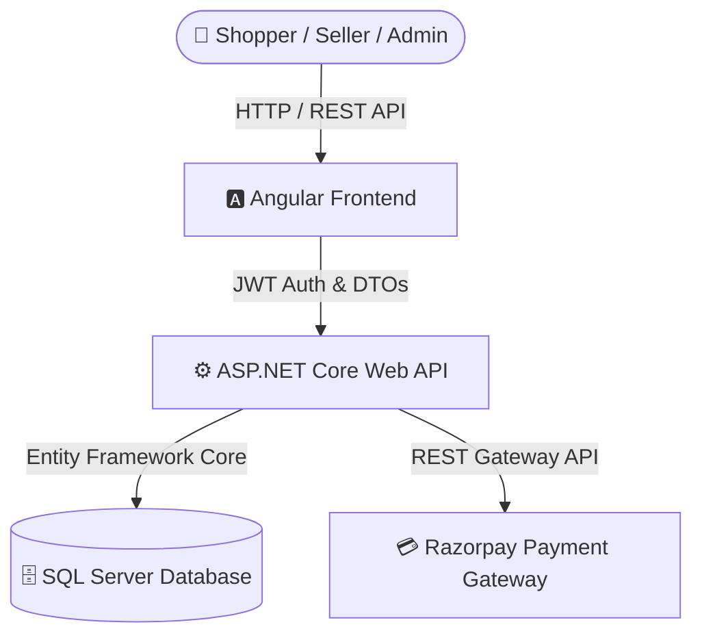

# 📚 Merxo E-Commerce Platform — Documentation Hub

> **Welcome to the Central Documentation Hub for Merxo E-Commerce Platform (Temu-Clone).**  
> This directory houses comprehensive, role-tailored visual user manuals, interactive workflows, screen wireframes, and operational guidelines.

---

## 🗺️ Master User Manual Directory

Select your target platform role below to access the complete visual user guide:

```
┌─────────────────────────────────────────────────────────────────────────────────────────────────┐
│ 🛒 CUSTOMER USER GUIDE                                                                          │
│ Complete manual for account setup, catalog browsing, currency conversion, cart management,     │
│ Razorpay & COD payments, coupon redemption, live order tracking, and product reviews.          │
│ ➔ Open Document: [Customer User Guide](USER_MANUAL.md)                                           │
├─────────────────────────────────────────────────────────────────────────────────────────────────┤
│ 🏬 SELLER OPERATIONS & STORE MANAGER GUIDE                                                      │
│ Comprehensive manual for seller onboarding, payout configuration, dashboard analytics,          │
│ listing products with color/size variants, moderation approval workflow, and order shipping.    │
│ ➔ Open Document: [Seller Operations Manual](SELLER_MANUAL.md)                                  │
├─────────────────────────────────────────────────────────────────────────────────────────────────┤
│ 🛡️ SYSTEM ADMINISTRATOR & MODERATION MANUAL                                                     │
│ Enterprise manual for executive GMV dashboard, seller verification queue, catalog moderation,    │
│ category hierarchy, homepage banners, promotional coupons, currency rates, and Razorpay logs. │
│ ➔ Open Document: [Admin Control Panel Manual](ADMIN_MANUAL.md)                                  │
└─────────────────────────────────────────────────────────────────────────────────────────────────┘
```

---

## ⚡ Role-Based Quick Reference Cards

### 🛒 Customer Quick Reference
- 📱 **Account Setup**: [Register & Address Book](USER_MANUAL.md#1-account-setup--profile-security)
- 🔍 **Discovery & Search**: [Filters & Currency Switcher](USER_MANUAL.md#2-product-discovery--shopping-experience)
- 🛒 **Cart & Payments**: [Razorpay & COD Payments](USER_MANUAL.md#5-checkout--secure-payment-flow)
- 🚚 **Order Management**: [Live Shipment Tracking](USER_MANUAL.md#6-order-tracking--post-purchase-services)

### 🏬 Seller Quick Reference
- 🚀 **Store Setup**: [Registration & Bank Details](SELLER_MANUAL.md#1-seller-registration--store-setup)
- 📊 **Analytics**: [Dashboard & Low Stock Alerts](SELLER_MANUAL.md#2-seller-dashboard--revenue-analytics)
- 📦 **Products**: [Color/Size Variant Matrix](SELLER_MANUAL.md#3-product-catalog-management--variant-matrix)
- 🚚 **Fulfillment**: [Order Shipping & Tracking Numbers](SELLER_MANUAL.md#5-order-fulfillment--courier-logistics)

### 🛡️ Admin Quick Reference
- 📊 **Executive Overview**: [Platform GMV & Revenue Analytics](ADMIN_MANUAL.md#2-executive-admin-dashboard)
- 🏬 **Seller Approvals**: [Application Verification Queue](ADMIN_MANUAL.md#4-seller-onboarding--moderation-queue)
- 📦 **Moderation**: [Product Approval Queue](ADMIN_MANUAL.md#5-product-catalog-moderation)
- 🎟️ **Promotions & Rates**: [Coupons Engine](ADMIN_MANUAL.md#7-coupons--promotional-discount-engine) \| [Exchange Rates](ADMIN_MANUAL.md#8-multi-currency--live-exchange-rates)

---

## 🏗️ Platform Technology Stack



- **Frontend**: Angular, RxJS, TypeScript, SCSS, Responsive HTML5
- **Backend**: ASP.NET Core Web API, C#, Entity Framework Core
- **Database**: SQL Server
- **Payment Processing**: Razorpay (Credit/Debit Cards, UPI, NetBanking, COD)
- **Security**: JWT Bearer Tokens, Role Guards (`BuyerGuard`, `SellerGuard`, `AdminGuard`)

---

*For codebase repository overview and setup instructions, refer to the root [README.md](../README.md).*
