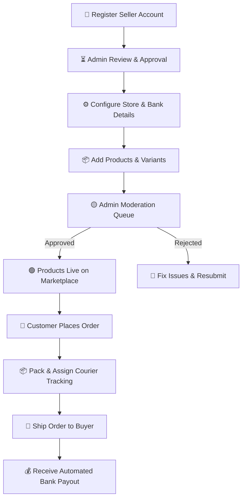

# 🏬 Merxo Seller Center — Operations & Store Management Guide

> **Welcome to the Merxo Seller Center!**  
> This operational user manual guides registered sellers through setting up a digital storefront, managing product catalogs and variant matrix, monitoring inventory, fulfilling customer orders, and analyzing revenue growth.

---

## 🎯 Quick Navigation & Role Overview

| Attribute | Details |
| :--- | :--- |
| **User Role** | Registered Seller / Store Owner |
| **Seller Portal URL** | `https://merxo.com/seller` (or local `http://localhost:4200/seller`) |
| **Access Requirement** | Approved Seller Account (`SellerGuard` authenticated) |
| **Fulfillment Responsibility** | Order Packing, Inventory Management, Courier Tracking Assignment |
| **Payout Cycle** | Weekly / Bi-weekly direct bank payouts |

---

## 🗺️ Seller Operations Lifecycle



---

## 📌 Table of Contents

1. [Seller Registration & Store Setup](#1-seller-registration--store-setup)
2. [Seller Dashboard & Revenue Analytics](#2-seller-dashboard--revenue-analytics)
3. [Product Catalog Management & Variant Matrix](#3-product-catalog-management--variant-matrix)
4. [Product Moderation Lifecycle](#4-product-moderation-lifecycle)
5. [Order Fulfillment & Courier Logistics](#5-order-fulfillment--courier-logistics)
6. [Store Ratings & Customer Feedback](#6-store-ratings--customer-feedback)
7. [Seller FAQ & Policy Guidelines](#7-seller-faq--policy-guidelines)

---

## 1. Seller Registration & Store Setup

### Step-by-Step Onboarding

```
┌─────────────────────────────────────────────────────────────────────────────────────────────────┐
│ 🏬 MERXO SELLER REGISTRATION                                                                     │
├─────────────────────────────────────────────────────────────────────────────────────────────────┤
│ Business Name:   [ Apex Electronics Ltd                       ]                                 │
│ Owner Name:      [ John Doe                                   ]                                 │
│ Contact Email:   [ seller@apexelectronics.com                 ]                                 │
│ Phone Number:    [ +1 (555) 234-5678                          ]                                 │
│ Password:        [ •••••••••••••••                            ]                                 │
│                                                                                                 │
│                                                   [ 🚀 SUBMIT SELLER APPLICATION ]              │
└─────────────────────────────────────────────────────────────────────────────────────────────────┘
```

1. **Submit Application**:
   - Go to `https://merxo.com/auth/register-seller`.
   - Fill in your **Business Name**, **Owner Name**, **Email**, **Phone**, and **Password**.
   - Click **Submit Seller Application**.
2. **Admin Verification**:
   - Your application enters the Admin Verification queue.
   - Upon approval (usually within 24 hours), you can log in directly at `/seller/dashboard`.

### Configuring Store Branding & Payout Details
- Go to **Seller Portal** > **Settings** > **Store Profile** (`/seller/profile`).
- **Store Name & Description**: Enter your public shop title and business description.
- **Logo & Header Banner**: Upload a high-resolution logo (500x500px) and header banner.
- **Bank Account Setup**:
  - Enter **Account Name**, **Account Number**, **IFSC / Routing Code**, and **Bank Name**.
  - Verified completed sales payouts are credited directly to this bank account.

---

## 2. Seller Dashboard & Revenue Analytics

### 📊 Seller Dashboard Wireframe

```
┌─────────────────────────────────────────────────────────────────────────────────────────────────┐
│ 📊 SELLER DASHBOARD                                                       [ 📅 Last 30 Days ▾ ] │
├──────────────────────────┬──────────────────────────┬──────────────────────────┬────────────────┤
│ 💰 TOTAL REVENUE         │ 📦 TOTAL ORDERS          │ 🟢 LIVE PRODUCTS         │ ⚠️ LOW STOCK    │
│ $ 48,250.00              │ 342 Orders               │ 28 Products              │ 3 Items Alert  │
│ 📈 +14.2% vs last month  │ 📦 12 Pending Dispatch   │ 🟡 2 Pending Moderation  │ 🔴 1 Out Stock │
└──────────────────────────┴──────────────────────────┴──────────────────────────┴────────────────┘

┌─────────────────────────────────────────────────────────────────────────────────────────────────┐
│ 📈 REVENUE TRENDS (USD $)                                                                       │
│  $5k ┤                                               ╭──╮                                       │
│  $4k ┤                                 ╭──╮         ╱    ╰───╮                                  │
│  $3k ┤                   ╭────╮       ╱    ╰────╮  ╱         ╰─                              │
│  $0k └─┴──────┴──────┴───┴────┴───────┴─────────┴─┴──────────┴────────────────────────────────  │
│       Week 1   Week 2     Week 3       Week 4       Week 5                                      │
└─────────────────────────────────────────────────────────────────────────────────────────────────┘
```

### Dashboard Metrics Explained
- **Total Revenue**: Total earnings from completed and delivered customer orders.
- **Total Orders**: All incoming customer orders across fulfillment statuses.
- **Live Products**: Approved listings visible to shoppers on the platform.
- **Low Stock Alerts**: Automatic warning triggered when any product variant inventory drops below **5 units**.

---

## 3. Product Catalog Management & Variant Matrix

### 📝 Product Creator & Variant Editor Wireframe

```
┌─────────────────────────────────────────────────────────────────────────────────────────────────┐
│ 📝 ADD NEW PRODUCT LISTING                                                 [ 📌 Status: DRAFT ]  │
├─────────────────────────────────────────────────────────────────────────────────────────────────┤
│ Product Name:     [ Wireless Bluetooth Earbuds V5.3                                           ] │
│ Category:         [ Electronics ▾ ]      Subcategory: [ Audio & Headphones ▾ ]                  │
│ Brand:            [ SoundCore ▾ ]        Base Price:  [ $ 49.99 ]   Sale Price: [ $ 39.99 ]       │
├─────────────────────────────────────────────────────────────────────────────────────────────────┤
│ 🎨 VARIANT MATRIX (Enable Colors & Sizes)                                                       │
│                                                                                                 │
│ Variant Combination       SKU Code        Price Delta     Stock Qty       Primary Image         │
│ ─────────────────────────────────────────────────────────────────────────────────────────────── │
│ [⚫ Black] / [ M ]        EAR-BLK-M       +$0.00          [ 50 ]          [📷 Upload Black.jpg] │
│ [⚪ White] / [ M ]        EAR-WHT-M       +$0.00          [ 35 ]          [📷 Upload White.jpg] │
│ [🔵 Navy]  / [ M ]        EAR-NVY-M       +$2.00          [  4 ] ⚠️ Low   [📷 Upload Navy.jpg]  │
├─────────────────────────────────────────────────────────────────────────────────────────────────┤
│                                                      [ 📄 SAVE DRAFT ]  [ 📤 SUBMIT FOR APPROVAL ]│
└─────────────────────────────────────────────────────────────────────────────────────────────────┘
```

### Creating Products Step-by-Step

> [!TIP]
> Listings with high-resolution main images and complete variant swatches receive **3x higher customer conversion rates**.

1. **Basic Info**: Enter title, category, subcategory, brand, and detailed product description.
2. **Set Pricing & Stock**: Input regular base price, promotional discount price, and warehouse stock units.
3. **Configure Variants**:
   - Enable **Has Variants** toggle.
   - Add **Color Swatches** and **Sizes**.
   - Specify individual SKUs, stock quantities, and prices for each variant.
4. **Media Upload**: Upload high-resolution images (recommended: 1000x1000px JPG/PNG). Drag to set the primary thumbnail image.
5. **Submit**: Click **Submit for Approval**.

---

## 4. Product Moderation Lifecycle

Every product listed by a seller is subject to platform quality checks:

```
[ 📝 Draft ] ───> [ 🟡 Pending Approval ] ───> [ 🟢 Approved & Live ]
                          │
                          └───> [ 🔴 Rejected (Requires Edit) ]
```

### Moderation Status Breakdown

| Listing Status | Marketplace Visibility | Action Required |
| :--- | :---: | :--- |
| 📝 **Draft** | ❌ Hidden | Complete product details and click Submit. |
| 🟡 **Pending Approval** | ❌ Hidden | Submitted to Admin moderation queue (24-48 hrs). |
| 🟢 **Approved & Live** | **✅ Live** | Product is live! Monitor stock and fulfill orders. |
| 🔴 **Rejected** | ❌ Hidden | Read admin feedback note, correct issues, and resubmit. |

> [!WARNING]
> **Common Rejection Causes**: Low-quality blurry images, misleading descriptions, prohibited items, or incorrect category selection.

---

## 5. Order Fulfillment & Courier Logistics

### 📦 Seller Order Management Panel

```
┌─────────────────────────────────────────────────────────────────────────────────────────────────┐
│ 📦 CUSTOMER ORDERS                                                                             │
├───────────┬──────────────────────────┬──────────┬──────────────┬────────────────────────────────┤
│ Order ID  │ Customer / Items         │ Amount   │ Status       │ Action                         │
├───────────┼──────────────────────────┼──────────┼──────────────┼────────────────────────────────┤
│ #ORD-9842 │ Sarah Jenkins (2 Items)  │ $129.99  │ 🟡 Pending   │ [ 📦 Accept & Pack Order ]     │
│ #ORD-9839 │ Mark Taylor (1 Item)     │ $39.99   │ 🔵 Processing│ [ 🚚 Assign Courier & Ship ]   │
│ #ORD-9821 │ Alex Rivera (3 Items)    │ $210.50  │ 🚚 Shipped   │ Track: #BLUEDART-884219        │
│ #ORD-9800 │ David Smith (1 Item)     │ $89.00   │ ✅ Delivered │ Completed on Sep 05            │
└───────────┴──────────────────────────┴──────────┴──────────────┴────────────────────────────────┘
```

### Fulfillment Workflow & SLAs

1. **Pending Order**:
   - New order notification received.
   - Click **Accept & Pack Order**. Status moves to **Processing**.
2. **Processing & Packaging**:
   - Print shipping slip and pack product in secure box.
3. **Dispatch & Ship**:
   - Hand package to courier partner.
   - Click **Mark as Shipped**.
   - Input **Courier Partner Name** (e.g., *FedEx, BlueDart, DHL*) and **Tracking / AWB Number**.
   - Click **Confirm Shipment**. The buyer will immediately receive automated tracking notifications.

> [!IMPORTANT]
> Orders must be accepted and marked **Processing** within **24 hours** to maintain a High Performance Seller Rating.

---

## 6. Store Ratings & Customer Feedback

```
┌─────────────────────────────────────────────────────────────────────────────────────────────────┐
│ ⭐ STORE RATING OVERVIEW                                                                         │
├──────────────────────────────────────────────────────┬──────────────────────────────────────────┤
│ Overall Store Rating:  ⭐⭐⭐⭐⭐ (4.8 / 5.0 Stars)    │ Rating Breakdown:                        │
│ Total Reviews:        142 Reviews                    │ 5 Stars  ████████████████████  82%       │
│ Fulfillment Rate:     99.2% On-Time Dispatch         │ 4 Stars  ████░░░░░░░░░░░░░░░░  12%       │
│ Return Rate:          0.8% Low Return Rate           │ 3 Stars  █░░░░░░░░░░░░░░░░░░░   4%       │
└──────────────────────────────────────────────────────┴──────────────────────────────────────────┘
```

- Access buyer feedback under **Seller Portal** > **Reviews** (`/seller/reviews`).
- Customer ratings directly influence your storefront search ranking and eligibility for featured homepage promotional banners.

---

## 7. Seller FAQ & Policy Guidelines

**Q: When are seller sales payouts processed?**  
A: Payouts are calculated automatically for orders in **Delivered** status past the standard 7-day customer return window. Payouts are transferred to your registered bank account every Tuesday.

**Q: Can I put my store on pause while on vacation?**  
A: Yes! Go to **Settings** > **Store Profile** and switch **Store Status** to **Vacation Mode**. Your product listings will be temporarily hidden from customer search without losing variant configurations or ratings.

---

*Thank you for selling with Merxo E-Commerce Platform!*
